## Project Summary

The Video Game Library is an ASP.NET Core MVC application that allows users to store and manage information about video games, their genres, and platforms. Users can add new games, edit existing ones, and view related genres and platforms. This project demonstrates key ASP.NET Core MVC concepts, including entity modeling, separation of concerns with dependency injection, CRUD operations, diagnostics, logging, and the use of stored procedures. It also includes deployment to Azure to showcase a production-ready environment.

## Weekly Feature Planning

| Week | Concept | Feature | Goal | Acceptance Criteria | Evidence | Test Plan |
|------|---------|---------|------|------------------|---------|-----------|
| 10 | Modeling | Create Game, Genre, Platform entities | Store games and associate genres/platforms | - [ ] Tables created - [ ] Many-to-many relationships work | Screenshots; write-up | Run migrations; check DB tables exist |
| 11 | Separation of Concerns / DI | Add GameService | Move game logic out of controller | - [ ] Service registered in DI - [ ] Controller uses service - [ ] Games can be retrieved | Screenshots; write-up | Call service endpoints; verify results |
| 12 | CRUD | Create/Edit/Delete forms for games | Users can manage games | - [ ] Forms display - [ ] Validation works - [ ] Changes persist in DB | Screenshots; write-up | Add/edit/delete a game; check DB |
| 13 | Diagnostics | `/healthz` endpoint | Check DB connectivity | - [ ] Returns healthy if DB is up - [ ] Returns unhealthy if DB down | Screenshots; write-up | Stop DB and test endpoint |
| 14 | Logging | Log game CRUD actions | Track structured logs | - [ ] Logs for each CRUD action - [ ] Logs include game ID | Screenshots; write-up | Perform CRUD; check logs |
| 15 | Stored Procedures | Get top 5 most recently released games | Demonstrate calling a stored procedure and displaying results | - [ ] SP executes - [ ] Results displayed in app | SQL script; code snippet calling SP; screenshot of results | Add games with genres; run SP in DB; verify displayed results |
| 16 | Deployment | Deploy to Azure | Make app publicly accessible | - [ ] App Service created - [ ] App works online | Screenshots; write-up; URL | Visit URL; test `/healthz` and game list |

---
## Week 10 – Modeling

For Week 10, I set up the basic data model for the **VideoGameLibrary** app. I created three main entities: **Game**, **Genre**, and **Platform**, and added simple fields for each. For example, `Name` is required for all three entities, ensuring that every record has a meaningful identifier. The `Game` entity also includes optional fields for `ReleaseDate` and `Description` to provide additional details when available, without forcing unnecessary data entry. These fields help capture the essential information for each game while keeping the database simple and easy to manage at this stage.

Because games can belong to multiple genres and be available on multiple platforms, I added two join tables: **GameGenre** and **GamePlatform**. These tables enforce the many-to-many relationships between games, genres, and platforms, making sure that each combination is unique and properly structured.

I placed the entity classes in the **Models** folder and created a **VideoGameLibraryContext** in a **Data** folder. The DbContext includes `DbSet` properties for all entities and configures the composite keys for the join tables. I also registered the context in `Program.cs` using a connection string stored in `appsettings.json`.

Finally, I created and applied the initial migration. This successfully generated the database with all tables and relationships, providing a solid foundation for implementing CRUD operations, logging, and other features in the following weeks. 

#### Database Tables

**Games Table**  
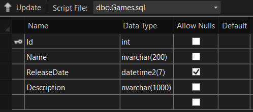

**Genres Table**  

**Platforms Table**  
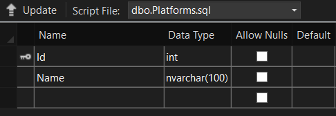

**GameGenres Table**  
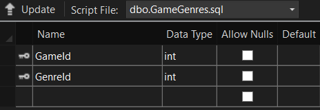

**GamePlatforms Table**  
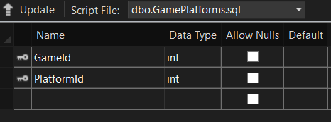

---
### Week 11 – Separation of Concerns / Dependency Injection

For Week 11, I implemented **Separation of Concerns** and **Dependency Injection** in the VideoGameLibrary app. The goal was to create any non-UI logic in a dedicated service, keeping controllers thin and focused only on handling HTTP requests and responses. To do this, I created a new service called `GameService` with an interface `IGameService`. The interface defines the contract for the service, including methods to retrieve all games and get a game by its ID. This ensures that controllers only depend on the interface, not the implementation, making the application more modular and easier to maintain.

The `GameService` contains all the logic for querying the database through `VideoGameLibraryContext`, including loading related data like genres and platforms. I registered the service in the dependency injection container using `AddScoped` in Program.cs, which provides one service instance per HTTP request. Then, I injected `IGameService` into the `GamesController` constructor and used it in both the `Index` and `Details` actions. This keeps the controller lightweight, with no direct database access.

To test the service, I added a test game to the database. Visiting `/Games` displays all games using the service, and `/Games/Details/{id}` shows the details for a single game. This setup demonstrates that the service is properly injected, the controller is thin, and all logic is separated from the UI.

#### Evidence

**Games Service**  
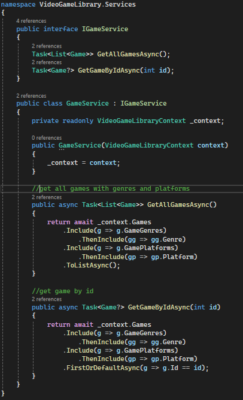

**Games Controller**  
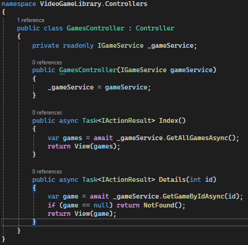

**Games Page**  
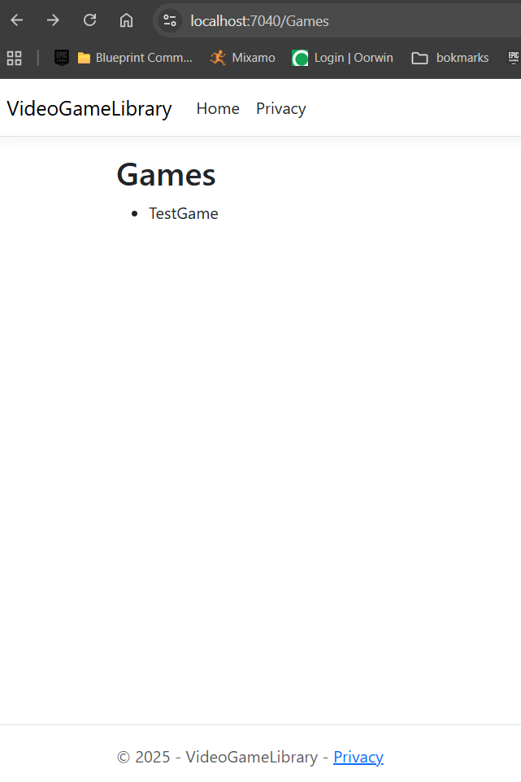

**Game Details Page**  
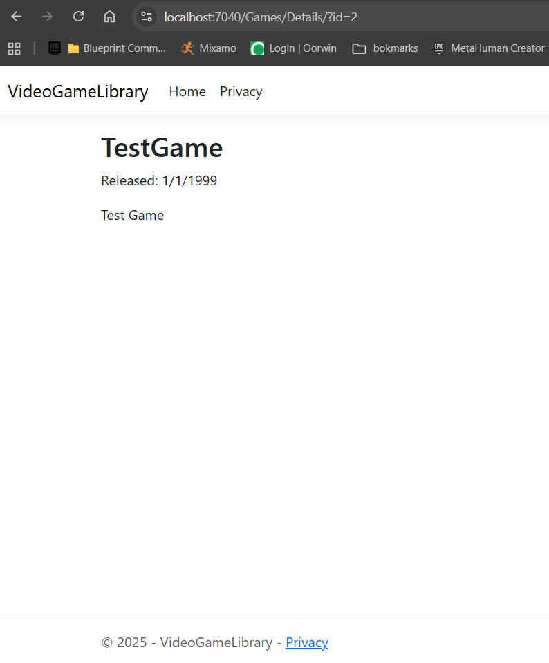

---

## Week 12 – CRUD Functionality

For Week 12, I focused on adding full CRUD functionality to the **VideoGameLibrary** app. This update allows users to create, view, edit, and delete games directly through the web interface. I implemented asynchronous data access methods such as `ToListAsync()`, `FindAsync()`, and `SaveChangesAsync()` to make database operations faster and more efficient. Using async methods also helps the app handle multiple requests smoothly without slowing down or freezing while data is being processed.

The `Game` model includes simple fields like `Name`, `ReleaseDate`, and `Description`, keeping things straightforward while still showing how model validation works in MVC. The Create and Edit pages include form validation and antiforgery tokens to protect against invalid or malicious submissions. When required fields are left blank, the app displays helpful validation messages to guide users to fix the issue before saving.

With these features complete, all CRUD actions now work properly. Games can be added, displayed in a list, updated, or deleted, and all actions reflect immediately in the database. This milestone represents the first time the app feels fully interactive, allowing real data changes from the front end. It also sets up a solid base for adding more advanced features in future weeks. on as I move into diagnostics, logging, and stored procedures in the next few weeks before deploying the app.

### Screenshots

**Games List Page**  
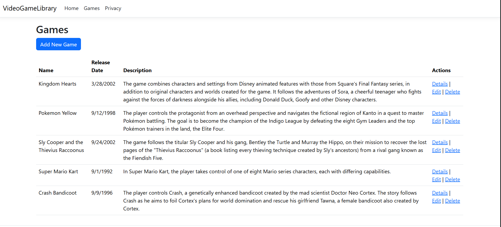

**Game Details Page**  
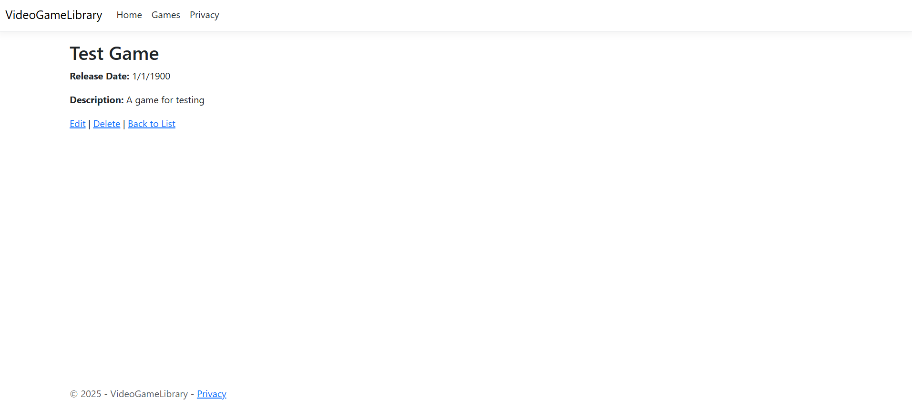

**Create Game Page**  
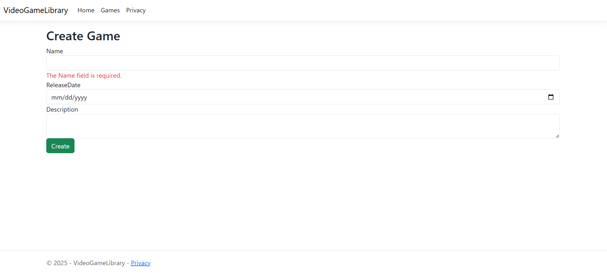

**Edit Game Page**  
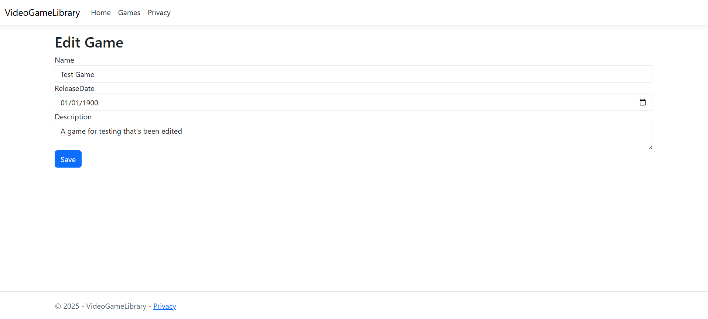

**Delete Game Confirmation**  
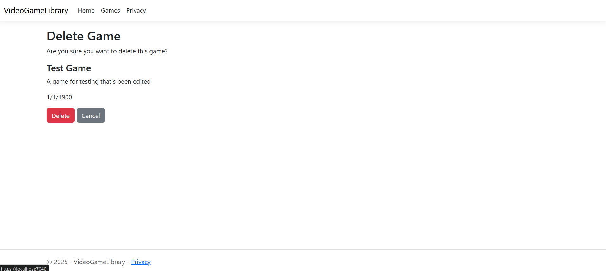

---

## Week 13 – Diagnostics

For Week 13, I implemented a **Diagnostics** feature in the VideoGameLibrary app. The goal was to add a health endpoint that reports on the status of at least one real dependency. In this case, the database is the key dependency, so the health check verifies that the app can connect to the SQL database correctly.

I added a `/healthz` endpoint using ASP.NET Core’s built-in health checks. The endpoint is mapped in `Program.cs` and includes a response writer that returns JSON with the overall status and details for each dependency. For example, the database component reports whether it is healthy and includes a description if any issues occur. This way, it is easy to see at a glance whether the app can access required resources, and any failure is clearly indicated for troubleshooting purposes without exposing sensitive information like connection strings or credentials.

Testing the endpoint is straightforward: navigating to `/healthz` in a browser or sending an HTTP request shows the JSON output. When the database is available, the status shows as “Healthy,” and if the database cannot be reached, it shows “Unhealthy” with a description of the problem. This feature provides a simple but effective way to monitor the app’s health and will be useful for future deployments or troubleshooting in a production environment.

### Screenshot

**Health Endpoint Response**  
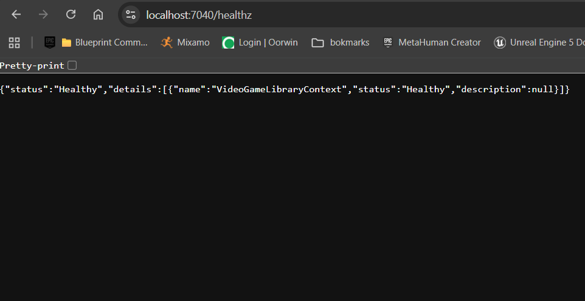

---

## Week 14 – Logging

For Week 14, I implemented a **Logging** feature in the VideoGameLibrary app. The goal was to add structured, actionable logs along a key path in the application, providing visibility into both successful operations and potential errors. I chose the CRUD actions for the Game entity as the main path for logging, specifically focusing on create, edit, and delete operations.

I injected an `ILogger<GamesController>` into the `GamesController` via dependency injection. Within the controller, I added log statements for the following scenarios:

- **Success paths:** When a game is successfully created, edited, or deleted, an information-level log is generated including key details such as the game’s ID and name.  
- **Error paths:** If a model validation fails, if a route ID does not match the game ID, or if an exception occurs during database operations, a warning or error-level log is generated with structured details.

The logs are structured to include useful fields, making them easy to filter or search for troubleshooting. They appear in the console during development, and in a production environment could be directed to a file or external logging service. Testing was done by performing CRUD operations and observing the logs for both successful actions and intentionally triggered validation errors or exceptions.

### Screenshots

**Successful Game Creation Log**  
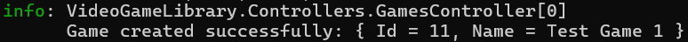

**Error Path Log (Validation Failure)**  
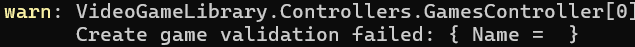

---

### Week 15 – Stored Procedures

For Week 15, I implemented the stored procedure feature for the VideoGameLibrary app. I created a simple procedure called `GetNewestGames` in the database using LocalDB within Visual Studio. This procedure retrieves the top 5 most recently released games by selecting the Id, Name, ReleaseDate, and Description columns from the Games table and ordering the results in descending order of release date. The stored procedure allows the database to handle this query efficiently, separating it from application logic.

I saved the SQL script as `sql/GetNewestGames.sql` in the project folder and committed it to GitHub as evidence of the procedure. This ensures that the procedure can be recreated or reviewed independently of the database.

In the application, I added a method `GetNewestGamesAsync` in the `GameService` class, which calls the stored procedure using EF Core's `FromSqlRaw` and returns the results asynchronously. I also added a `NewestGames` action in the `GamesController` to fetch the data and pass it to a new view, `NewestGames.cshtml`. This view displays the results in a simple table. Finally, I added a “View Newest Games” button to the main Games index page, providing easy navigation. The feature was tested by navigating to `/Games/NewestGames` and confirming that the top 5 most recent games are displayed correctly.

### Screenshots

**Newest Games Button**  
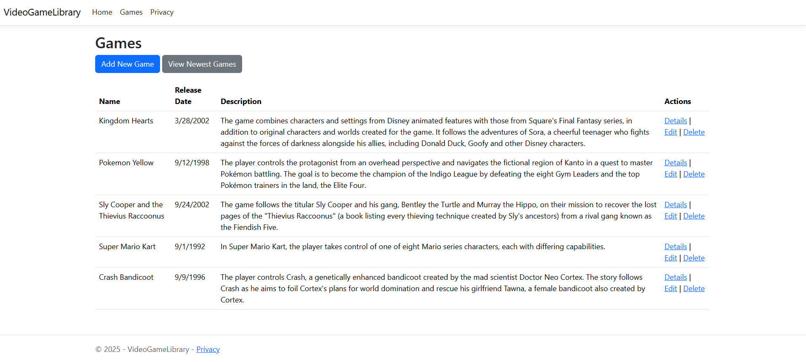

**Newest Games Page**  
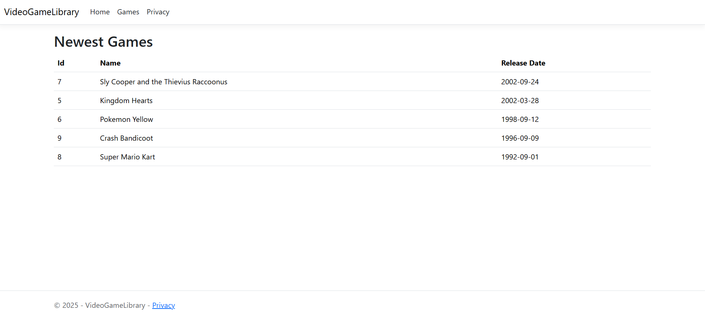
